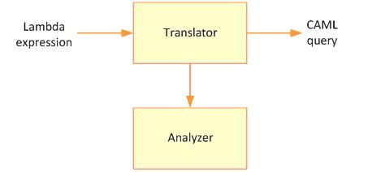
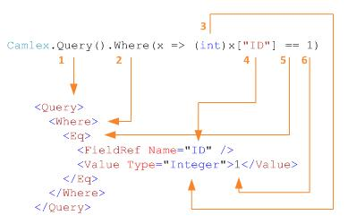

Pages with future improvements - [Future improvements](Future-improvements)

**Additional Resources**
* Camlex Online [http://camlex-online.org](http://camlex-online.org)
* Blog [http://sadomovalex.blogspot.com](http://sadomovalex.blogspot.com/search/label/Camlex.NET)

**I. Camlex architecture and public interface**
Generally Camlex – is translator from lambda expression into CAML:

It receives expression like
{code:c#}
x => (int)x["ID"](_ID_) == 1
{code:c#}
on input and translate it to valid CAML query. The exact signature of lambda expressions depends on method call of Camlex public interface. The most important interface in Camlex.NET assembly is IQuery and its implementation – Query class:
{code:c#}
public interface IQuery
{
    IQuery Where(Expression<Func<SPListItem, bool>> expr);
    IQuery WhereAll(IEnumerable<Expression<Func<SPListItem, bool>>> expressions);
    IQuery WhereAny(IEnumerable<Expression<Func<SPListItem, bool>>> expressions);
    IQuery OrderBy(Expression<Func<SPListItem, object>> expr);
    IQuery OrderBy(Expression<Func<SPListItem, object>> expr);
    IQuery OrderBy(IEnumerable<Expression<Func<SPListItem, object>>> expressions);
    IQuery GroupBy(Expression<Func<SPListItem, object>> expr);
    IQuery GroupBy(Expression<Func<SPListItem, object>> expr, bool? collapse, int? groupLimit);
    IQuery GroupBy(Expression<Func<SPListItem, object>> expr, bool? collapse, int? groupLimit);
    IQuery GroupBy(Expression<Func<SPListItem, object>> expr, int? groupLimit);
    IQuery GroupBy(Expression<Func<SPListItem, object>> expr, bool? collapse);
    XElement ToCaml(bool includeQueryTag);
    string ToString();
    string ToString(bool includeQueryTag);
}
{code:c#}
As you can see most methods returns itself – so fluent interfaces calls are available with Camlex:
{code:c#}
var caml =
    Camlex.Query()
        .Where(x => x["Status"](_Status_) != null)
        .GroupBy(x => x["CreatedBy"](_CreatedBy_)).ToString();
{code:c#}
Also notice that it has ToCaml() method which returns valid xml in array of XElement objects. It means that it can be simply customizable – for example you can use Linq to Xml or classes from System.Xml.Linq namespace in order to modify resulting query.

**II. Lambda expressions syntax**
Internally Camlex uses expression trees in order to parse lambda expressions and translate it to CAML. There are 2 types of syntaxes allowed in Camlex (here and below “x” – is a parameter for lambda expression with SPListItem data type defined inMicrosoft.Sharepoint.dll):
# Native syntax:
{code:c#}
x => (int)x["ID"](_ID_) == 1
{code:c#}
I.e. you write integer rvalue and cast lvalue to int
# String based syntax:
{code:c#}
x => x["ID"](_ID_) == (DataTypes.Integer)"1"
{code:c#}
In opposite with native syntax you write integer value in string representation and cast it to DataTypes.Integer class (helper class defined in Camlex.NET.dll)
Two examples above are equivalent for Camlex. We introduced 2 types of syntaxes in order to be able to write queries with not only native .Net types (int, string, bool, DateTime), but also with Sharepoint data types (see [http://msdn.microsoft.com/en-us/library/microsoft.sharepoint.spfieldtype.aspx](http://msdn.microsoft.com/en-us/library/microsoft.sharepoint.spfieldtype.aspx)). You can easy mix these syntaxes and composite them via logical operations (&&, ||) in the same expression.
The following schema shows how Camlex translates lambda expression with native into CAML query:

String based syntax is very similar except Camlex uses rvalue cast to DataTypes.Integer in order to determine type of value and checks that string representation contains valid value for this type.
What happens if Camlex cannot parse lambda expression? As described above there are only 2 types of syntaxes (and their combination via logical && and || operations) are valid for Camlex. If provided expression has different signature – then CamlexNET.NonSupportedExpressionException will be thrown.

**III. Supported operations**
The list of operations available in CAML query can be found on [http://msdn.microsoft.com/en-us/library/ms467521.aspx](http://msdn.microsoft.com/en-us/library/ms467521.aspx). Camlex supports all of them. The following table shows mapping from C# operations into CAML with examples:
|| CAML || C# || Example ||
| And | && | {"Camlex.Query().Where(x => (string) x["Status"](_Status_) == "Completed" && (int) x["ID"](_ID_) == 1)"} |
| Or | {"||"}  | {"Camlex.Query().Where(x => (string)x["Status"](_Status_)(_Status_) != "Completed" || x["Status"](_Status_)(_Status_) == null)"} |
| BeginsWith | String. StartsWith() | {"Camlex.Query().Where(x => ((string)x["Title"](_Title_)).StartsWith("Camlex"))"} |
| Contains | String. Contains() | {"Camlex.Query().Where(x => ((string)x["Title "](_Title-_)).Contains("Camlex"))"} |
| Eq | == | {"Camlex.Query().Where(x => (string)x["Title"](_Title_) == "Camlex")"} |
| Neq | != | {"Camlex.Query().Where(x => (string)x["Status"](_Status_) != "Completed")"} |
| Geq | >= | {"Camlex.Query().Where(x => (int)x["ID"](_ID_) >= 1)"} |
| Gt | > | {"Camlex.Query().Where(x => (int)x["ID"](_ID_) > 1)"} |
| Leq | <= | {"Camlex.Query().Where(x => (int)x["ID"](_ID_) <= 1)"} |
| Lt | < | {"Camlex.Query().Where(x => (int)x["ID"](_ID_) < 1)"} |
| DateRangesOverlap | Camlex.DateRangesOverlap() | {"Camlex.Query().Where(x => Camlex.DateRangesOverlap(x["StartField"](_StartField_), x["StopField"](_StopField_), x["RecurrenceID"](_RecurrenceID_), (DataTypes.DateTime)Camlex.Month))"} |
| IsNotNull | != null | {"Camlex.Query().Where(x => x["Status"](_Status_) != null)"} |
| IsNull | == null | {"Camlex.Query().Where(x => x["Title"](_Title_) == null)"} |
| OrderBy	 | IQuery.OrderBy() | {"Camlex.Query().Where(x => (string)x["Status"](_Status_) == "Completed").OrderBy(x => x["Modified"](_Modified_) as Camlex.Desc)"} |
| GroupBy | IQuery.GroupBy | {"Camlex.Query().Where(x => (string)x["Status"](_Status_) == "Completed").GroupBy(x => new { x["Modified"](_Modified_), x["Editor"](_Editor_) }, true, 10)"} |

**IV. Non-constant expressions and runtime evaluation**
You can specify non-constant expressions both in indexer and in rvalue:
{code:c#}
x => (Type)x[expr1](expr1) == expr2
{code:c#}
expr1 and expr2 are evaluated in runtime. If expr1 or expr2 is method call and it throws exception – then exception will be thrown when query will be evaluated. I.e. Camlex doesn’t catch exceptions when it evaluates expression in runtime. Notice also that expr1 (indexer’s parameter) should have string type. If expr1 cannot be casted to string then Camlex throws InvalidFieldNameForFieldRefException:
{code:c#}
public static void Scenario()
{
    Func<object> expr1 = () => null;
    Func<object> expr2 = () => 1;

    var caml =
        Camlex.Query()
            .Where(x => (string)x[(string)expr1()]((string)expr1()) == expr2()).ToString();
}
{code:c#}
Another interesting example – is when expr2 is null and operation is == or !=. In this case Camlex will translate <IsNull> and <IsNotNull> instead of <Eq> and <Neq> respectively:
{code:c#}
public static void Scenario()
{
    Func<object> expr1 = () => "Title";
    Func<object> expr2 = () => null;

    var caml =
        Camlex.Query()
            .Where(x => (string)x[(string)expr1()]((string)expr1()) == expr2()).ToString();

    Console.WriteLine(caml);
}
{code:c#}
Will be translated into <IsNull>:
{code:xml}
<Where>
  <IsNull>
    <FieldRef Name="Title" />
  </IsNull>
</Where>
{code:xml}
While not-null rvalue:
{code:c#}
public static void Scenario()
{
    Func<object> expr1 = () => "Title";
    Func<object> expr2 = () => "Camlex";

    var caml =
        Camlex.Query()
            .Where(x => (string)x[(string)expr1()]((string)expr1()) == expr2()).ToString();

    Console.WriteLine(caml);
}
{code:c#}
Will be translated into <Eq>:
{code:xml}
<Where>
  <Eq>
    <FieldRef Name="Title" />
    <Value Type="Text">Camlex</Value>
  </Eq>
</Where>
{code:xml}

**V. Dynamic filtering conditions**
This feature is added in 2.0 version. Often developers need to build CAML query based on predefined set of values. E.g. search items which have Ids contained in array {1, 2, 3} (analog of IN operator in SQL), or retrieve all items which contains one of the substrings (or all of them) in their Title { “hello”, “world” }. For this use case in version 2.0 were added 2 additional methods in IQuery interface WhereAll and WhereAny (by analogy with All and Any methods in Linq). The main difference is that WhereAll and WhereAny methods receive list of lambda expressions (or more accurate – IEnumerable) in contrast to Where method which receives single lambda expression.

By analogy with Linq WhereAll method constructs CAML query for retrieving those items which satisfy all conditions specified in argument. I.e. WhereAll method contructs CAML query using <And> logical join. WhereAny method returns CAML query which can be used to retrieve items which satisfy at least one of specified conditions – it uses <Or> logical join. The general idea is to create list of lambda expressions and pass this list into Camlex. It will composite expressions using And or Or joins – so it will have one big expression as result and pass it in old Where method from 1.0 version.

Notice that you can create various expressions – i.e. not necessary to create the same expression for each value. You can even provide different argument names in expressions – Camlex hasn't restrictions to have the same argument names for all provided expressions. For example we need to select item which have ID = 1 and which Title = “Hello world”:
{code:xml}
<Where>
    <And>
        <Eq>
            <FieldRef Name="ID" />
            <Value Type="Integer">1</Value>
        </Eq>
        <Eq>
            <FieldRef Name="Title" />
            <Value Type="Text">Hello world</Value>
        </Eq>
    </And>
</Where>
{code:xml}
It can be done using the following code:
{code:c#}
var expressions = new List<Expression<Func<SPListItem, bool>>>();
expressions.Add(x => (int)x["ID"](_ID_) == 1);
expressions.Add(y => (string)y["Title"](_Title_) == "Hello world");

string caml = Camlex.Query().WhereAll(expressions).ToString();
{code:c#}
I.e. Camlex may successfully translate queries with different arguments names (“x” and “y” in example above).